## Reactive Java? <br />Let us count the ways!

<br />

Erin Schnabel<br /><small>@ebullientworks</small>

Ozzy Osborne<br /><small>@ozzydweller</small>

---

## What is Reactive?

Different way of solving problems

* Asynchronous
* ***Streams*** of elements
  * Potentially unbounded
* Application "reacts" to elements as they arrive
  * Parallel (order not guaranteed)

---

## Reactive Manifesto

* Responsive: rapid and consistent response times
* Resilient: replication, containment, isolation, delegation
* Elastic: "react to *changes in input rate*"; avoid contention points & bottlenecks
* **Message Driven:**
  * *asynchronous* message passing
  * *non-blocking* communication

<small>https://www.reactivemanifesto.org/</small>

---

## Reactive Streams

* A [Publisher](http://www.reactive-streams.org/reactive-streams-1.0.2-javadoc/org/reactivestreams/Publisher.html) provides sequenced elements
* A [Subscriber](http://www.reactive-streams.org/reactive-streams-1.0.2-javadoc/org/reactivestreams/Subscriber.html) handles notifications (e.g. *onNext*)
* Publishers emit elements according to Subscriber demand (backpressure, etc.)
* *Focused on Stream lifecycle, not operators*

<small>Reactive Streams: http://www.reactive-streams.org/<br/>
Java 9: java.util.concurrent.Flow</small>

--

## "Hot" vs. "Cold" Publisher

* Hot: shared view for all subscribers (multicast)
  * Continuous stream of events, independent of subscriber

* **Cold**: unique view for each subscriber (unicast)
  * No events emitted until there is an subscriber

---

## Playing with Operators

Reactive libraries have subtly different terminology

* RxJava
* Spring WebFlux (Spring 5)
* Akka

--

### Understanding Marble Diagrams

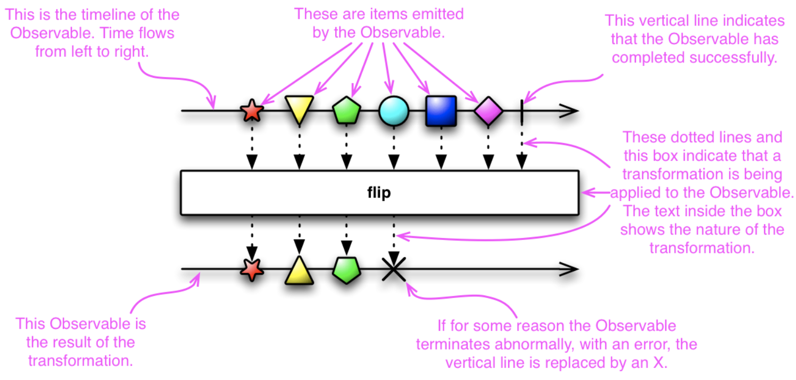

--

### `map` operator

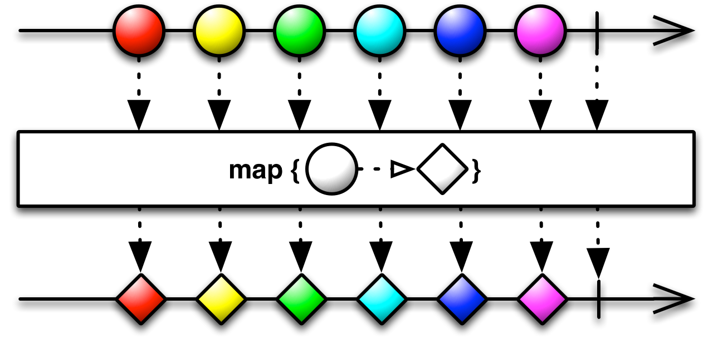

--

### `filter` operator

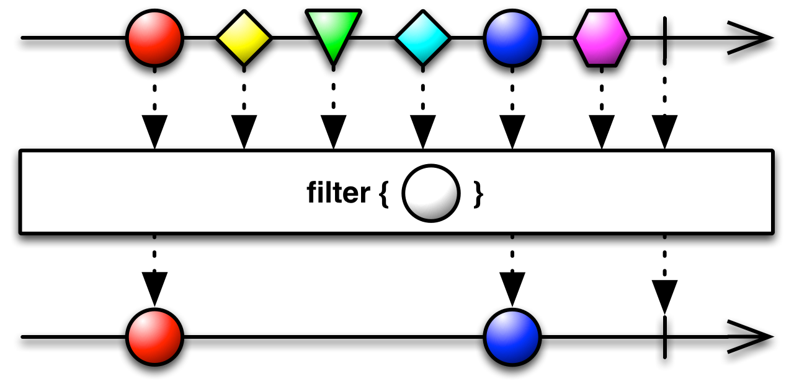

--

### `merge` operator


--

### `scan` operator

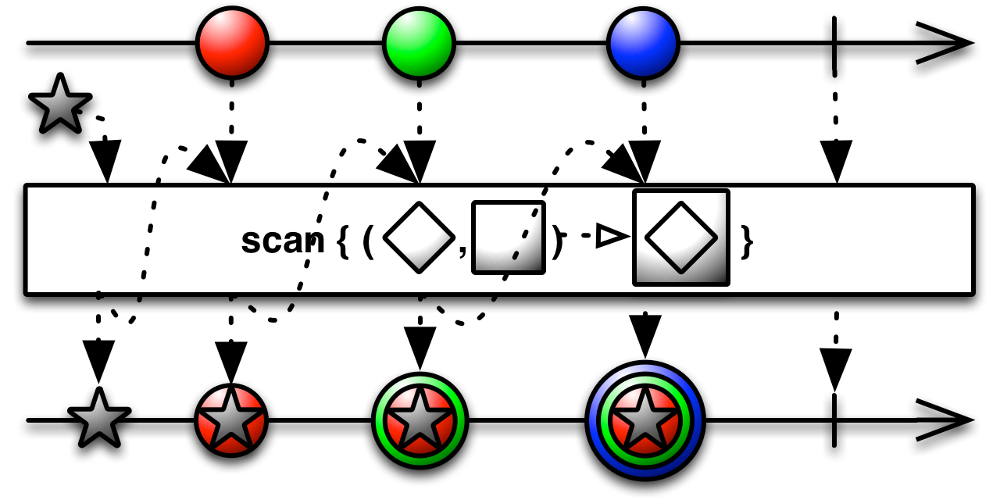

<small>This variation specifies a starting value.</small>

--

## Chaining operators 
<!-- .slide: data-background-image="kuang-si-falls-waterfall-water-laos-50588-faded.jpeg" -->

A single operator is not very powerful.

_Operators are **chained** to create more complex solutions._

---

## ReactiveX

* An _Observable_ emits a sequence of items
* _Single_ emits one item
* An _observer_ **subscribes** to an _Observable_.

* _Flowable_ (RxJava2, backpressure behavior) is like _Observable_

<small>http://reactivex.io/</small><br />
<small>RX(Js|.net|Scala|Clojure|Swift|Python|Lua|Ruby|andmore)</small>

---

## RxJava: Exercise 1

1. lowercase & strip punctuation using `map`
2. create stream of 'b' words
3. create stream of 'g' words
4. merge streams (hint: `mergeWith`)

--

### RxJava: Exercise 1 -- Checkpoint

```java
Observable<String> fixedWords = words()
    .map(word -> word.toLowerCase().replaceAll("^[a-zA-Z]",""));
Observable<String> bwords = fixedWords.
    .filter(word -> word.startsWith("b");
Observable<String> gwords = fixedWords.
    .filter(word -> word.startsWith("g");
Observable<String> result = bwords.mergeWith(gwords);
```

---

### `flatMap` operator

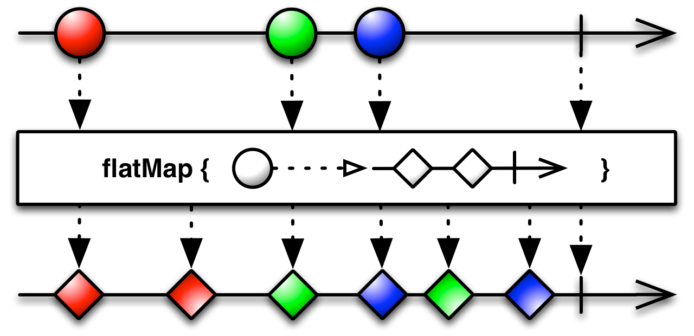

---

### `groupBy` operator


---

### `zipWith` operator

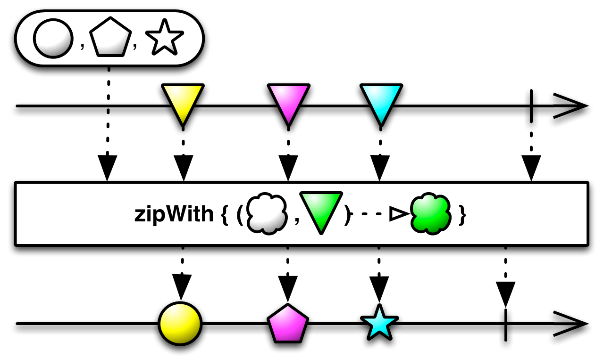

---

## RxJava: Exercise 2a

1. streams of arrays
2. streams of streams (hint `Observable.fromArray`)

--

### RxJava: Exercise 2a -- Checkpoint

```java
Observable<String> filtered = lines().filter(line -> line.length()>0);
Observable<String[]> aResult = filtered
    .map(line -> line.split(" "));
Observable<Observable<String>> sResult = filtered
    .map(line -> Observable.fromArray(line.split(" "));
```

--

## RxJava: Exercise 2b

1. `flatMap` an array
2. `flatMap` a stream of streams

--

### RxJava: Exercise 2b -- Checkpoint

```java
Observable<String> awords = aresult
    .flatMap( arr -> Observable.fromArray(arr) );
Observable<String> swords = sresult
    .flatMap( obs -> obs );
```

--

## RxJava: Exercise 2c

1. `groupBy` to group by first letter
2. `flatMap` to merge the stream of streams

--

### RxJava: Exercise 2c -- Checkpoint

```java
Observable<String> result = words()
    .groupBy( word -> word.charAt(0) )
    .flatMap( obs -> obs );
```

--

## RxJava: Exercise 2d

1. stream of lengths
2. stream of lengths and words, via zipWith
3. mapping pairs to string output

--

### RxJava: Exercise 2d -- Checkpoint

```java
Observable<String> result = words()
    .map( word -> word.length() )
    .zipWith( words(), Pair::new )
    .map( pair -> ""+pair.getA()+": "+pair.getB());
```

---

## Spring Reactor Core and `WebFlux`

* Reactor is rooted in Reactive Streams
* API alignment with RxJava where possible
  * **Rx `Observable` -> `Flux`**
  * **Rx `Single` -> `Mono`** 
* Tight integration with Spring concepts: [WebFlux RestController](https://docs.spring.io/spring/docs/5.0.0.BUILD-SNAPSHOT/spring-framework-reference/html/web-reactive.html#web-reactive-server-annotation)

---

## WebFlux: Exercise 1

1. lowercase & strip punctuation using `map`
2. create stream of 'b' words
3. create stream of 'g' words
4. merge streams (hint: `mergeWith`)

--

### WebFlux: Exercise 1 -- Checkpoint

```java
Flux<String> fixedWords = words()
    .map(word -> word.toLowerCase().replaceAll("[^a-zA-Z]",""));
Flux<String> bwords = fixedWords.
    .filter(word -> word.startsWith("b");
Flux<String> gwords = fixedWords.
    .filter(word -> word.startsWith("g");
Flux<String> result = bwords.mergeWith(gwords);
```

---

## WebFlux: Exercise 2a

1. streams of arrays
2. streams of streams (hint `Flux.fromArray`)

--

### WebFlux: Exercise 2a -- Checkpoint

```java
Flux<String> filtered = lines().filter(line -> line.length()>0);
Flux<String[]> arrResult = filtered
    .map(line -> line.split(" "));
Flux<Flux<String>> fluxResult = filtered
    .map(line -> Flux.fromArray(line.split(" "));
```

--

## WebFlux: Exercise 2b

1. `flatMap` an array
2. `flatMap` a stream of streams

--

### WebFlux: Exercise 2b -- Checkpoint

```java
Flux<String> awords = arrResult
    .flatMap( arr -> Flux.fromArray(arr) );
Flux<String> fwords = fluxResult
    .flatMap( flx -> flx );
```

--

## WebFlux: Exercise 2c

1. `groupBy` to group by first letter
2. `flatMap` to merge the stream of streams

--

### WebFlux: Exercise 2c -- Checkpoint

```java
Flux<String> result = words()
    .groupBy( word -> word.charAt(0) )
    .flatMap( flx -> flx );
```

--

## WebFlux: Exercise 2d

1. stream of lengths
2. stream of lengths and words, via `zipWith`
3. mapping pairs to string output (hint, default `Pair` impl!)

--

### WebFlux: Exercise 2d -- Checkpoint

```java
Flux<String> result = words()
    .map( word -> word.length() )
    .zipWith( words() )
    .map( pair -> ""+pair.getT1()+": "+pair.getT2());
```

---

## Akka

Akka focuses on how messages flow

* Source: something with exactly one output stream
* Sink: something with exactly one input stream
* Flow: something with exactly one input and one output stream

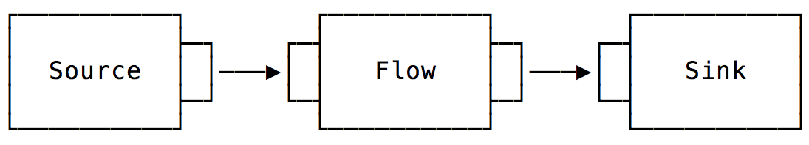
<small>https://blog.redelastic.com/diving-into-akka-streams-2770b3aeabb0</small>

---

### `merge` operator

<small>A "Fan-in" operator</small>

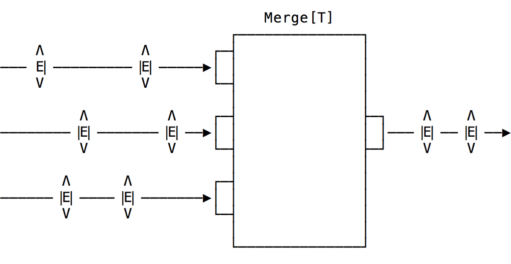
<small>https://blog.redelastic.com/diving-into-akka-streams-2770b3aeabb0</small>

---

### Akka: Exercise 1

1. lowercase & strip punctuation using `map`
2. create stream of 'b' words
3. create stream of 'g' words
4. merge streams (hint: actually `merge`)

--

#### Akka: Exercise 1 -- Checkpoint

```java
Source<String,NotUsed> fixedWords = words()
    .map(word -> word.toLowerCase().replaceAll("[^a-zA-Z]",""));
Source<String,NotUsed> bwords = fixedWords.
    .filter(word -> word.startsWith("b");
Source<String,NotUsed> gwords = fixedWords.
    .filter(word -> word.startsWith("g");
Source<String,NotUsed> result = bwords.merge(gwords);
```

---

### Akka: Exercise 2a

1. streams of arrays
2. streams of streams (hint `Source.from` / `Arrays.asList`)

--

#### Akka: Exercise 2a -- Checkpoint

```java
Source<String> filtered = lines().filter(line -> line.length()>0);
Source<String[],NotUsed> arrResult = filtered
    .map(line -> line.split(" "));
Source<Source<String,NotUsed>,NotUsed> srcResult = filtered
    .map(line -> Source.from(Arrays.asList(line.split(" ")));
```

--

### Akka: Exercise 2b

1. `flatMapConcat` an array
2. `flatMapConcat` a stream of streams

--

#### Akka: Exercise 2b -- Checkpoint

```java
Source<String,NotUsed> awords = arrResult
    .map(x->Source.from(Arrays.asList(x)))
    .flatMapConcat(src-> src);
Source<String,NotUsed> swords = srcResult
    .flatMapConcat(src-> src);
```

--

### `flatMapConcat` operator

<small>A "Flattening" operator</small>

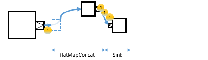<br />
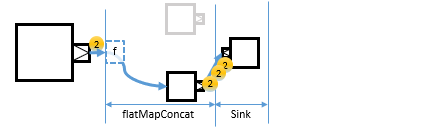

<small>https://doc.akka.io/docs/akka/current/stream/stream-substream.html</small>

--

### Akka: Exercise 2c

1. `groupBy` to group by first letter (first arg is max group count!)
2. `mergeSubstream`s (NOT flatMap!!) to merge substreams

--

#### Akka: Exercise 2c -- Checkpoint

```java
Source<String,NotUsed> words()
    .groupBy(26, word -> word.charAt(0))
    .mergeSubstreams();
```

--

### `groupBy` operator

<small>A "Nesting" operator</small>

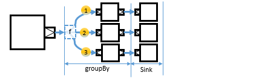
<small>https://doc.akka.io/docs/akka/current/stream/stream-substream.html</small>

--

### `mergeSubstreams` operator

<small>A "Nesting" operator</small>

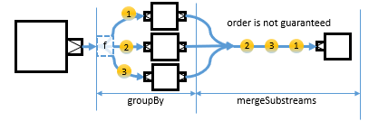
<small>https://doc.akka.io/docs/akka/current/stream/stream-substream.html</small>

--

### Akka: Exercise 2d

1. stream of lengths
2. stream of lengths and words, via zipWith
3. mapping pairs to string output (hint, `akka.japi.Pair`)

--

#### Akka: Exercise 2d -- Checkpoint

```java
Source<String,NotUsed> result = bs
    .filter(s -> s.length()>0)
    .map(s -> s.length())
    .zipWith(words(),Pair::new)
    .map(s -> s.toString());
```

---

## Reactive frameworks

* [Lagom](https://www.lagomframework.com/) (Lightbend: Akka and Play)
  * [Akka Actor Model](https://doc.akka.io/docs/akka/current/actors.html)
* [Vert.x](https://vertx.io/) (Rx*, or Reactor, or Akka)

* Standardizing operators
  * [MicroProfile Reactive Streams](https://github.com/eclipse/microprofile-reactive-streams)
  * [https://github.com/reactor/reactive-streams-commons](https://github.com/reactor/reactive-streams-commons) (dormant)

---

## Resources

* [Reactive Streams Glossary of Terms](https://github.com/reactive-streams/reactive-streams-jvm/blob/v1.0.1/README.md#glossary)
* [Reactive Manifesto Glossary of Terms](https://www.reactivemanifesto.org/glossary) 
* [A Journey into Reactive Streams](https://blog.redelastic.com/a-journey-into-reactive-streams-5ee2a9cd7e29) -- Kevin Webber<br />
A mostly impl neutral overview of Reactive Streams API usage, with diagrams, scenarios etc.. 
